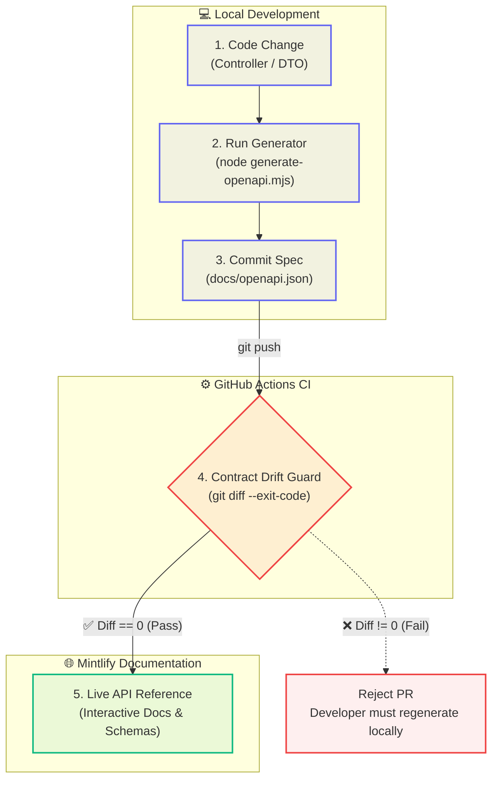

# API Design

## 🚀 Interactive API Explorer (Swagger UI)

The backend ships with **Swagger UI** — an interactive browser-based explorer where you can read documentation, inspect schemas, and execute real HTTP requests without leaving the browser.

| Resource | URL |
|---|---|
| **Swagger UI** | [`http://localhost:8080/swagger-ui.html`](http://localhost:8080/swagger-ui.html) |
| **OpenAPI JSON spec** | [`http://localhost:8080/v3/api-docs`](http://localhost:8080/v3/api-docs) |

### How to Test in Swagger UI

1. **Start the backend**
   ```bash
   cd backend
   ./mvnw spring-boot:run
   ```

2. **Open Swagger UI** → navigate to `http://localhost:8080/swagger-ui.html`

3. **Browse endpoint groups** — the sidebar shows three tag groups:
   - **Execution API** — Run code & Submit solution
   - **Questions API** — List and get questions
   - **Health API** — Liveness check

4. **Expand an endpoint** — click on any endpoint card (e.g. `POST /api/v1/executions`)

5. **Click "Try it out"** — this enables editing the request body (already active by default)

6. **Edit the JSON payload** — replace the example values with your test data

7. **Click "Execute"** — the UI sends the real HTTP request to `localhost:8080`

8. **Inspect the response** — the response body, HTTP status code, and equivalent `curl` command all appear below

> **Tip:** The OpenAPI JSON spec at `/v3/api-docs` can be imported into Postman or Insomnia for offline testing.

---

## 🔄 API Contract Lifecycle & Drift Guard

To prevent silent breaking changes between the backend and frontend, our API contract follows a strict **code-first with CI drift enforcement** workflow:



### Why we do this:
1. **Frontend-Backend Synchronization:** When a DTO field name, type, or validation rule changes, the change is visible immediately in the GitHub Pull Request diff under `docs/openapi.json`.
2. **Fail-Fast CI Guard:** If a backend engineer changes an API signature but forgets to update `docs/openapi.json`, CI fails the build with a clear error instruction. CI deliberately does *not* auto-commit changes—forcing developers to review contract modifications before pushing.
3. **Automated Documentation:** Mintlify reads `docs/openapi.json` directly to power the live, interactive API Reference pages without manual documentation writing.

---

| Environment | Base URL |
|---|---|
| Local | `http://localhost:8080` |
| Production | `https://<your-render-service>.onrender.com` |

---

## Endpoints

### POST `/api/v1/executions` — Run Code

Executes user code against a single input for experimentation (the "Run" button).

**Request body:**
```json
{
  "language": "java",
  "sourceCode": "class Solution { public int[] twoSum(int[] nums, int target) { ... } }",
  "stdin": "2\n[2,7,11,15]\n9",
  "functionSignature": {
    "functionName": "twoSum",
    "params": [
      { "name": "nums", "type": "int[]" },
      { "name": "target", "type": "int" }
    ],
    "returnType": "int[]"
  }
}
```

**Response (200 OK — Success):**
```json
{
  "status": "SUCCESS",
  "stdout": "[0, 1]",
  "stderr": "",
  "compilationOutput": "",
  "executionTimeMs": 420,
  "memoryKb": 10240
}
```

**Response (200 OK — Compilation Error):**
```json
{
  "status": "COMPILATION_ERROR",
  "stdout": "",
  "stderr": "",
  "compilationOutput": "Solution.java:3: error: ';' expected\n  return nums\n             ^\n1 error",
  "executionTimeMs": 0,
  "memoryKb": 0
}
```

**Response (200 OK — Runtime Error):**
```json
{
  "status": "RUNTIME_ERROR",
  "stdout": "",
  "stderr": "Exception in thread \"main\" java.lang.ArrayIndexOutOfBoundsException: Index 5 out of bounds for length 3",
  "compilationOutput": "",
  "executionTimeMs": 150,
  "memoryKb": 8192
}
```

---

### POST `/api/v1/executions/submit` — Submit Solution

Evaluates code against the full test suite (visible + hidden). Returns a per-test-case verdict.

**Request body:**
```json
{
  "questionId": "two-sum",
  "language": "java",
  "sourceCode": "class Solution { ... }"
}
```

**Response (200 OK — All Passed):**
```json
{
  "status": "SUCCESS",
  "passed": 5,
  "total": 5,
  "totalExecutionTimeMs": 2100,
  "maxMemoryKb": 10240,
  "errorMessage": null,
  "testCaseResults": [
    {
      "id": "tc-1",
      "name": "Basic case",
      "result": "PASSED",
      "hidden": false,
      "input": "[2,7,11,15], 9",
      "expectedOutput": "[0,1]",
      "actualOutput": "[0,1]",
      "executionTimeMs": 420
    },
    {
      "id": "tc-3",
      "name": "Hidden test 1",
      "result": "PASSED",
      "hidden": true,
      "input": null,
      "expectedOutput": null,
      "actualOutput": null,
      "executionTimeMs": 380
    }
  ]
}
```

**Key behaviour — hidden test masking**: When `hidden: true`, `input`, `expectedOutput`, and `actualOutput` are deliberately set to `null` in the response. The user can see pass/fail but not the actual hidden test data.

---

### GET `/api/v1/questions` — List Questions

Returns all available problems with metadata (no test case data).

**Response (200 OK):**
```json
[
  {
    "id": "two-sum",
    "title": "Two Sum",
    "difficulty": "EASY",
    "tags": ["Array", "Hash Table"]
  }
]
```

---

### GET `/api/v1/questions/{id}` — Get Question

Returns full problem detail including visible test cases and function signature.

**Response (200 OK):**
```json
{
  "id": "two-sum",
  "title": "Two Sum",
  "difficulty": "EASY",
  "description": "...",
  "functionSignature": { ... },
  "sampleInput": "...",
  "starterCode": { "java": "class Solution { ... }" }
}
```

---

### GET `/actuator/health` — Health Check

Spring Boot Actuator liveness endpoint. Used by Render to determine if the container is healthy.

**Response (200 OK):**
```json
{ "status": "UP" }
```

---

## Status Codes Used

| HTTP Status | Scenario |
|---|---|
| 200 OK | All execution and question responses (including runtime errors — the HTTP call itself succeeded) |
| 400 Bad Request | Bean Validation failure (`@Valid` on request body) |
| 404 Not Found | Unknown `questionId` in submit |
| 500 Internal Server Error | Unhandled exception (mapped by Spring's default error handling) |

## Design Note: Why 200 for execution errors?

Execution outcomes like `COMPILATION_ERROR`, `RUNTIME_ERROR`, and `TIME_LIMIT_EXCEEDED` are returned as `200 OK` with a `status` field in the body. This is intentional:

- The **HTTP request itself succeeded** — Spring Boot received, processed, and responded to the request
- The **execution outcome** is a domain-level concept, not an HTTP transport error
- Returning `422` or `400` for a runtime error would conflate "your code crashed" with "your request was malformed"
- The frontend reads the `status` field to determine what to display

This is a common pattern in execution-as-a-service APIs.

## Validation

All request bodies are validated with `@Valid` + Jakarta Bean Validation annotations:
- `language`: not blank
- `sourceCode`: not blank, max size
- `questionId`: not blank

Validation failures return `400 Bad Request` with a structured error body.
